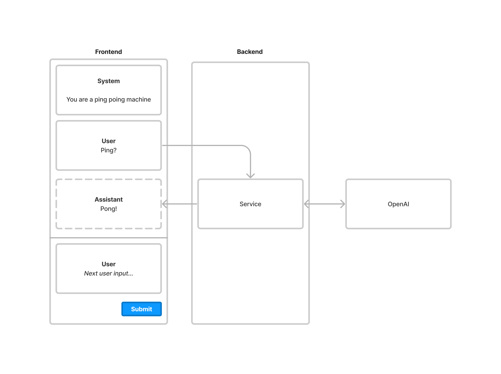

# Challenge: Server-side Streaming Playgrounds

Playgrounds have come to play a big role in LLM application development. It allows developers to discover the limits of the models, and learn how different variants of prompts produce different kinds of output.

You have a web application which displays the system, user and assistant (AI) messages, allows a user to type and submit additional messages and uses the OpenAI API to produce new assistant messages.



The provided skeleton repository uses the OpenAI API directly (without the backend to relay the requests). So your task is to extend it with one or more of the following options:

### Front-end focus: Add support for streaming generation in the front-end.

OpenAI supports streaming of generations. This provides a nice user experience, as long generations can be a bit jarring to wait for.

### Back-end focus: Move OpenAI calls to the NextJS API.

As you can tell, the call to OpenAI and its key management isn’t safe for production. Move the calls to NextJS API to make this more secure.

### Bonus: Streaming server side support.

Now that server side support of the OpenAI call, make it support streaming, too.

### Bonus: Use GraphQL API for server side support.

With or without streaming support (subscriptions), we prefer to use GraphQL over REST.

### Bonus: Add bells and whistles in the UI.

The skeleton implementation is very limited on purpose. Feel free to add the ability to change the system prompt, edit existing messages, adding new threads etc.

## Submission

Please zip your solution and email it as an attachment to us. We will run your code locally.

## Running the skeleton repository

Get started by replacing the OpenAI key in `src/app/page.tsx` and run the following:

```bash
yarn dev
```

or

```bash
npm dev
```
